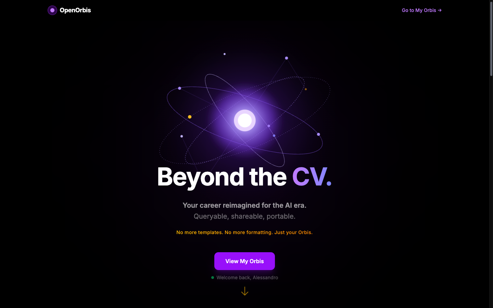
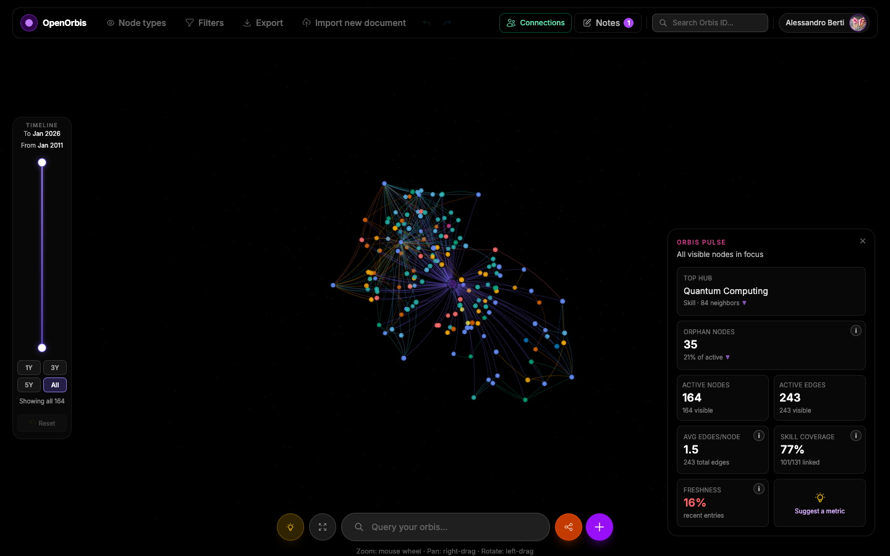

<h1 align="center">
  <picture>
    <source media="(prefers-color-scheme: dark)" srcset="docs/assets/logo.svg">
    <source media="(prefers-color-scheme: light)" srcset="docs/assets/logo-light.svg">
    
  </picture>
</h1>

<p align="center">
  <em>Beyond the CV.<br>Your career as a knowledge graph — queryable, shareable, portable.</em>
</p>

<p align="center">
  <a href="LICENSE"></a>
  <a href="https://github.com/Brotherhood94/orb_project/actions/workflows/lint.yml"></a>
  <a href="https://github.com/Brotherhood94/orb_project/actions/workflows/unit-tests.yml"></a>
  <a href="https://open-orbis.com"></a>
</p>

<p align="center">
  <a href="https://open-orbis.com">
    
  </a>
  <br>
  <sub><em>Landing page — your career as a living, orbiting knowledge graph.</em></sub>
</p>

<br>

## What is OpenOrbis?

OpenOrbis turns your CV into a **living, interactive 3D knowledge graph**. Instead of a static PDF, your professional identity — skills, experience, education, projects, publications, awards, outreach, and more — becomes a queryable data structure that both humans and AI agents can explore.

🌐 **Share it** — every orbis gets a unique URL and QR code, ready to send to recruiters or embed in your portfolio

🤖 **Query it** — AI agents (Claude, Cursor, Copilot) can access your graph natively via the **Model Context Protocol (MCP)**

---

## See it in action

<p align="center">
  
  <br>
  <sub><em>/myorbis — your graph, Orbis Pulse metrics, date-range timeline, and chat-style search.</em></sub>
</p>

A typical session:

1. **Upload your CV** (PDF / DOCX / TXT) — the pipeline extracts experiences, skills, education, publications, projects and more as typed nodes.
2. **Review and edit** the extracted entries in tabbed lists before they touch the graph.
3. **Explore** the 3D orbis: rotate, zoom, filter by node type or keyword, slide the timeline.
4. **Share** — copy the public URL, generate a scannable QR, or grant access by email with per-viewer privacy filters.
5. **Query via MCP** — connect Claude / Cursor / an MCP-aware agent to ask questions about your graph in natural language.

---

## Key Features

<table>
<tr>
<td width="33%" valign="top">

### For Users

- Upload a PDF CV or build node-by-node
- 3D interactive graph (Three.js)
- Export to PDF with page-break preview
- Shareable URL with QR code
- Draft notes with LLM enhancement
- Date range slider for temporal filtering
- Privacy-aware sharing via filter tokens
- Fuzzy + semantic vector search
- "Open to Work" flag

</td>
<td width="33%" valign="top">

### For AI Agents (MCP)

- `orbis_get_summary`
- `orbis_get_full_orb`
- `orbis_get_nodes_by_type`
- `orbis_get_connections`
- `orbis_get_skills_for_experience`
- Structured JSON responses
- Filter token access control

</td>
<td width="33%" valign="top">

### Privacy & Security

- Fernet encryption for PII at rest
- GDPR consent tracking
- 30-day soft-delete grace period
- Granular sharing with filter tokens
- Per-field encryption (email, phone, address)

</td>
</tr>
</table>

---

## Tech Stack

<table>
<tr><td><strong>Frontend</strong></td><td>React 19 · TypeScript · Vite 8 · Tailwind CSS v4 · Three.js · Framer Motion · Zustand</td></tr>
<tr><td><strong>Backend</strong></td><td>FastAPI · Python 3.10+ · Uvicorn</td></tr>
<tr><td><strong>Database</strong></td><td>Neo4j 5 (graph database with vector indexes)</td></tr>
<tr><td><strong>AI / LLM</strong></td><td>Anthropic Claude (via CLI) · Ollama (llama3.2:3b local fallback)</td></tr>
<tr><td><strong>Auth</strong></td><td>JWT (HS256) · Google OAuth · LinkedIn OAuth</td></tr>
<tr><td><strong>Encryption</strong></td><td>Fernet (cryptography)</td></tr>
<tr><td><strong>Agent Protocol</strong></td><td>MCP (Model Context Protocol)</td></tr>
<tr><td><strong>PDF</strong></td><td>PyMuPDF (extraction) · fpdf2 (generation)</td></tr>
<tr><td><strong>CI/CD</strong></td><td>GitHub Actions — lint · unit tests · CV extraction quality</td></tr>
<tr><td><strong>Package Mgrs</strong></td><td>uv (backend) · npm (frontend)</td></tr>
</table>

---

## Project Structure

```
orb_project/
├── frontend/                  # React + TypeScript app
│   └── src/
│       ├── pages/             # Landing, Create, View, Shared, Export, About, Privacy
│       ├── components/        # Graph, Editor, Chat, CV, Drafts, Onboarding, Landing
│       ├── stores/            # Zustand (auth, orb, filter, dateFilter, toast)
│       └── api/               # Axios clients
├── backend/                   # FastAPI app
│   ├── app/
│   │   ├── auth/              # JWT auth, Google/LinkedIn OAuth, GDPR, account lifecycle
│   │   ├── cv/                # PDF parsing, LLM classification, rule-based fallback
│   │   ├── graph/             # Neo4j client, Cypher queries, encryption, embeddings
│   │   ├── orbs/              # Graph CRUD, profile, filter tokens
│   │   ├── export/            # PDF / JSON / JSON-LD export
│   │   ├── search/            # Semantic vector + fuzzy text search
│   │   ├── notes/             # Draft notes with LLM enhancement
│   │   └── main.py            # App entry, middleware, CORS
│   ├── mcp_server/            # MCP tools for AI agents
│   └── tests/                 # Unit + integration tests
├── docs/                      # Detailed documentation
├── infra/                     # Neo4j init scripts (constraints, indexes)
├── docker-compose.yml         # Neo4j + Ollama services
├── .env.example               # Environment variable template
├── CLAUDE.md                  # AI session project guide
└── LICENSE                    # GNU AGPL v3
```

---

## Getting Started

### Prerequisites

- **Python** 3.10+
- **Node.js** 20+
- **Docker** and Docker Compose
- [**uv**](https://docs.astral.sh/uv/) (Python package manager)

### 1. Clone and configure

```bash
git clone https://github.com/Brotherhood94/orb_project.git
cd orb_project
cp .env.example .env
```

Edit `.env` and set at minimum:
- `JWT_SECRET` — a strong random string
- `ENCRYPTION_KEY` — generate with: `python -c "from cryptography.fernet import Fernet; print(Fernet.generate_key().decode())"`

### 2. Start infrastructure services

```bash
docker compose up -d    # Neo4j (7474/7687) + Ollama (11434)
```

### 3. Start the backend

```bash
cd backend
uv sync --all-extras
uv run uvicorn app.main:app --reload --port 8000
```

### 4. Start the frontend

```bash
cd frontend
npm ci
npm run dev             # http://localhost:5173
```

### 5. (Optional) Pull Ollama model

```bash
docker exec orbis-ollama ollama pull llama3.2:3b
```

### 6. Open the app

Navigate to http://localhost:5173 and sign in with Google or LinkedIn to start building your orbis.

---

## Environment Variables

| Variable | Description | Required |
|----------|-------------|:--------:|
| `NEO4J_URI` | Neo4j Bolt connection URI | Yes |
| `NEO4J_USER` | Neo4j username | Yes |
| `NEO4J_PASSWORD` | Neo4j password | Yes |
| `JWT_SECRET` | Secret for signing JWT tokens | Yes |
| `ENCRYPTION_KEY` | Fernet key for PII field encryption | Yes |
| `FRONTEND_URL` | Frontend origin for CORS | Yes |
| `BACKEND_URL` | Backend URL | Yes |
| `GOOGLE_CLIENT_ID` | Google OAuth client ID | Prod |
| `GOOGLE_CLIENT_SECRET` | Google OAuth client secret | Prod |
| `LINKEDIN_CLIENT_ID` | LinkedIn OAuth client ID | Prod |
| `LINKEDIN_CLIENT_SECRET` | LinkedIn OAuth client secret | Prod |
| `ANTHROPIC_API_KEY` | Claude API key | — |
| `OLLAMA_BASE_URL` | Ollama endpoint (default: `http://localhost:11434`) | — |
| `OLLAMA_MODEL` | Ollama model name (default: `llama3.2:3b`) | — |
| `LLM_PROVIDER` | LLM provider: `claude` or `ollama` (default: `claude`) | — |

> See [`.env.example`](.env.example) for the full template.

---

## Running Tests

```bash
# Backend unit tests (75% coverage minimum)
cd backend
uv run pytest tests/unit/ -v --tb=short --cov=app --cov-report=term-missing --cov-fail-under=50

# Backend linting
uv run ruff check .
uv run ruff format --check .

# Frontend linting
cd frontend
npm run lint
```

> See [`docs/testing.md`](docs/testing.md) for the full test strategy, CI pipelines, and CV extraction quality gates.

---

## MCP Integration

OpenOrbis includes an MCP server that exposes your knowledge graph to AI agents:

| Tool | Description |
|------|-------------|
| `orbis_get_summary` | Name, headline, location, node type counts |
| `orbis_get_full_orb` | Complete person profile + all nodes |
| `orbis_get_nodes_by_type` | Filter nodes by type (education, skill, etc.) |
| `orbis_get_connections` | All relationships of a specific node |
| `orbis_get_skills_for_experience` | Skills linked to a work experience or project |

```bash
cd backend
uv run python -m mcp_server.server    # streamable-http transport
```

---

## Knowledge Graph Schema

Each user's orb is a graph rooted at a **Person** node, connected to domain-specific nodes via typed relationships:

```
Person ──HAS_EDUCATION──────────► Education
       ──HAS_WORK_EXPERIENCE───► WorkExperience
       ──HAS_SKILL─────────────► Skill
       ──SPEAKS────────────────► Language
       ──HAS_CERTIFICATION─────► Certification
       ──HAS_PUBLICATION───────► Publication
       ──HAS_PROJECT───────────► Project
       ──HAS_PATENT────────────► Patent
       ──HAS_AWARD─────────────► Award
       ──HAS_OUTREACH──────────► Outreach
```

The key graph feature is **`USED_SKILL`** — a cross-link between experience nodes and Skill nodes, enabling queries like *"which skills were used at company X?"*

> See [`docs/database.md`](docs/database.md) for query patterns and indexes.

---

## Contributing

We welcome contributions from anyone interested in personal-knowledge-graph UX, graph databases, LLM-powered extraction, or the MCP ecosystem.

**Workflow:**

1. Fork the repo and clone your fork.
2. Create a feature branch — `git checkout -b feat/your-feature` (prefixes: `feat/`, `fix/`, `docs/`, `refactor/`, `test/`).
3. Keep PRs focused — one concern per PR.
4. Run linters + tests locally before pushing:
   ```bash
   cd backend  && uv run ruff check . && uv run ruff format --check . \
     && uv run pytest tests/unit/ -v --cov=app --cov-fail-under=50
   cd frontend && npm run lint && npm run build
   ```
5. Update the relevant docs in `docs/` (see [CLAUDE.md](CLAUDE.md) pre-PR check) — API, schema, navigation, or architecture changes each have their own file.
6. Open the PR against `main` with a Summary + Test plan + Documentation section.

Good first issues are tagged [`good first issue`](https://github.com/Brotherhood94/orb_project/labels/good%20first%20issue). If you want to discuss a larger change first, open an issue with your proposal.

---

## Roadmap & known limitations

**On the roadmap:**

- Mobile polish sweep (in progress — see [#369](https://github.com/Brotherhood94/orb_project/issues/369))
- Full E2E coverage across iOS Safari / Android Chrome
- Vector-embedding upgrade (currently deterministic placeholders for semantic search)
- Public-profile themes (custom accent colour + layout)
- Native mobile wrappers (PWA first, then considering Capacitor)
- Expanded MCP toolset (node creation, timeline queries)

**Known limitations today:**

- **LLM cost vs. quality trade-off** — Claude gives the best extraction quality; Ollama (`llama3.2:3b`) is the free local fallback but accuracy on complex CVs drops noticeably.
- **Semantic search** is wired end-to-end but the vector indexes use placeholder embeddings — planned swap to a production embedding model.
- **Admin dashboard** is desktop-first; mobile support is lower-priority.
- **Invite-code gate** — the project currently runs as a closed beta. Self-hosted instances can toggle this off via `/admin` once you promote yourself to admin.

---

## Documentation

Detailed documentation lives in [`docs/`](docs/):

| Document | Description |
|----------|-------------|
| [`architecture.md`](docs/architecture.md) | System design and data flow |
| [`api.md`](docs/api.md) | API endpoint reference |
| [`onboarding.md`](docs/onboarding.md) | Local setup and dev workflow |
| [`database.md`](docs/database.md) | Neo4j schema and query patterns |
| [`testing.md`](docs/testing.md) | Test strategy and CI pipelines |
| [`deployment.md`](docs/deployment.md) | Production setup and Docker |
| [`cv-extraction-quality.md`](docs/cv-extraction-quality.md) | CV extraction quality metrics |

---

<p align="center">
  Licensed under the <a href="LICENSE">GNU Affero General Public License v3.0</a>
</p>
