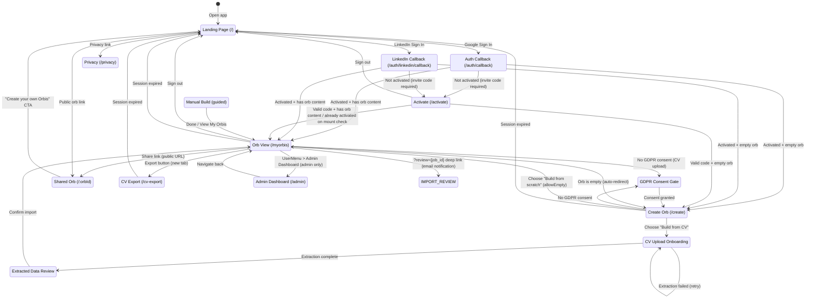
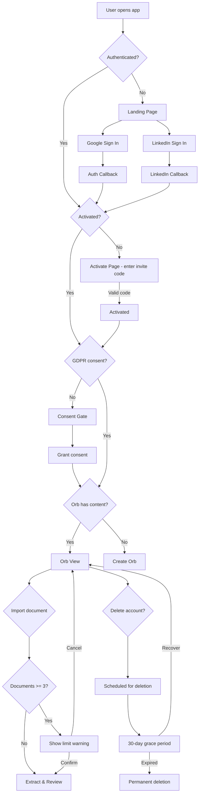

# OpenOrbis Navigation Flow Map

> Navigable user-flow map for agent-based UX evaluation. Covers all pages, modals, interactions, guards, and error states.
>
> **Last updated:** 2026-04-14 | **Issue:** #193, #274

## How to Update This Map

When the UI changes:
1. Update the Mermaid diagram below (add/remove states and transitions)
2. Update `docs/navigation-actions.yaml` (add/remove action entries)
3. Commit both files together so they stay in sync
4. Use stable state IDs (e.g., `LANDING`, `ORB_VIEW`) so test scripts can reference them

---

## Page/State Diagram

---

## OrbViewPage Interaction Map

```mermaid
stateDiagram-v2
    state "Orb View (main)" as MAIN

    %% ── Modals & Panels ──
    state "FloatingInput (Add/Edit Node)" as FLOATING_INPUT
    state "SharePanel (modal)" as SHARE_PANEL
    state "ProfilePanel (modal)" as PROFILE_PANEL
    state "AccountSettings (modal)" as ACCOUNT_SETTINGS
    state "DraftNotes (slide-out)" as DRAFT_NOTES
    state "Import Review (overlay)" as IMPORT_REVIEW
    state "Import Limit Warning (modal)" as IMPORT_LIMIT
    state "Guided Tour (overlay)" as GUIDED_TOUR
    state "Send Feedback (modal)" as FEEDBACK_MODAL

    %% ── Tabs inside AccountSettings ──
    state ACCOUNT_SETTINGS {
        [*] --> OrbisID_Tab
        OrbisID_Tab --> Versions_Tab
        Versions_Tab --> Account_Tab
        Account_Tab --> OrbisID_Tab
        state "Orbis ID" as OrbisID_Tab
        state "Versions" as Versions_Tab
        state "Account" as Account_Tab
    }

    %% ── Transitions ──
    MAIN --> FLOATING_INPUT: Click node / Click "+" / Draft "Add to graph"
    FLOATING_INPUT --> MAIN: Save / Cancel / Delete
    MAIN --> SHARE_PANEL: Click Share
    SHARE_PANEL --> MAIN: Close
    MAIN --> PROFILE_PANEL: Click profile image
    PROFILE_PANEL --> MAIN: Close
    MAIN --> ACCOUNT_SETTINGS: UserMenu > Account settings
    ACCOUNT_SETTINGS --> MAIN: Close
    MAIN --> DRAFT_NOTES: Click Notes button
    DRAFT_NOTES --> MAIN: Close
    DRAFT_NOTES --> FLOATING_INPUT: Enhance note / Add to graph
    MAIN --> IMPORT_LIMIT: Import file (at 3 docs)
    IMPORT_LIMIT --> MAIN: Cancel
    IMPORT_LIMIT --> IMPORT_REVIEW: Replace & import
    MAIN --> IMPORT_REVIEW: Import file (under limit) — async; polls job until complete
    IMPORT_REVIEW --> MAIN: Confirm / Cancel
    MAIN --> FEEDBACK_MODAL: Click "Send Feedback" button (above ChatBox)
    FEEDBACK_MODAL --> MAIN: Submit / Close
    MAIN --> GUIDED_TOUR: Auto-trigger (new user) / Settings sidebar "Guided tour"
    GUIDED_TOUR --> MAIN: Finish / Skip / Close
    ACCOUNT_SETTINGS --> GUIDED_TOUR: Sidebar "Guided tour" button
```

---

## Guard & Decision Diagram

---

## States Reference

| State ID | Route | Auth Required | Description |
|----------|-------|---------------|-------------|
| `LANDING` | `/` | No | Marketing page + sign-in buttons |
| `AUTH_CALLBACK` | `/auth/callback` | No | OAuth code exchange, sets JWT |
| `LINKEDIN_CALLBACK` | `/auth/linkedin/callback` | No | LinkedIn OAuth code exchange |
| `CREATE` | `/create` | Yes | Path selection (CV upload vs manual) |
| `CV_UPLOAD` | `/create` (subview) | Yes | PDF drag-and-drop + progress |
| `CV_REVIEW` | `/create` (subview) | Yes | Review extracted nodes before confirm |
| `MANUAL_BUILD` | `/create` (subview) | Yes | Step-by-step guided node creation |
| `ORB_VIEW` | `/myorbis` | Yes | Main orb editor/dashboard |
| `SHARED_ORB` | `/:orbId` | No | Public read-only orb view |
| `CV_EXPORT` | `/cv-export` | Yes | PDF CV generation and preview |
| `ACTIVATION` | `/activate` | Yes (not activated) | Invite code input page for closed beta. Checks activation status on mount — if already activated, redirects immediately. Admins bypass. |
| `ADMIN` | `/admin` | Yes + is_admin | Admin dashboard: invite codes, pending users (with Approve/Approve all), beta config toggle, CV Jobs tab, Feedback tab |
| `FEEDBACK_MODAL` | (modal on ORB_VIEW) | Yes | Send Feedback modal opened from above-ChatBox button. Submits to `/ideas` with `source=feedback`. |
| `PRIVACY` | `/privacy` | No | Privacy policy |
| `CONSENT_GATE` | (overlay) | Yes | GDPR consent checkbox |
| `FLOATING_INPUT` | (modal on ORB_VIEW) | Yes | Add/edit node form |
| `SHARE_PANEL` | (modal on ORB_VIEW) | Yes | Share links + QR code |
| `PROFILE_PANEL` | (modal on ORB_VIEW) | Yes | Edit profile + social links |
| `ACCOUNT_SETTINGS` | (modal on ORB_VIEW) | Yes | Orbis ID, Versions, Account tabs |
| `DRAFT_NOTES` | (panel on ORB_VIEW) | Yes | Draft notes list + management |
| `IMPORT_REVIEW` | (overlay on ORB_VIEW) | Yes | Review imported document data |
| `IMPORT_LIMIT` | (modal on ORB_VIEW) | Yes | Document limit confirmation |
| `GUIDED_TOUR` | (overlay on ORB_VIEW) | Yes | 9-step interactive tour (react-joyride). Auto-triggers for new users, restartable from Settings sidebar |

---

## Error & Edge States

| State | Trigger | UI Display | Recovery |
|-------|---------|-----------|----------|
| `LOADING` | Initial page load, API call | Spinner animation | Wait for completion |
| `EMPTY_ORB` | New user, no nodes | Hint message + arrow to "+" | Add first node |
| `ORB_NOT_FOUND` | Invalid `/:orbId` | "Orbis not found" page | Navigate to `/` |
| `IMPORT_FAILED` | PDF extraction error | Toast + error message | Retry upload |
| `API_ERROR` | Network/server failure | Toast notification | Retry action |
| `SESSION_EXPIRED` | JWT invalidated | Toast + redirect to `/` | Re-login |
| `ACCOUNT_PENDING_DELETION` | User deleted account | Banner + grayed features | Recover from Account tab |
| `INVITE_CODE_INVALID` | User enters wrong/used code on /activate | Inline error message | Try different code |
| `CV_NO_TEXT` | PDF has no extractable text | Error message | Try different file |
| `CV_PROCESSING_FAILED` | Background extraction job failed | Email notification + error in review page | Retry upload |
